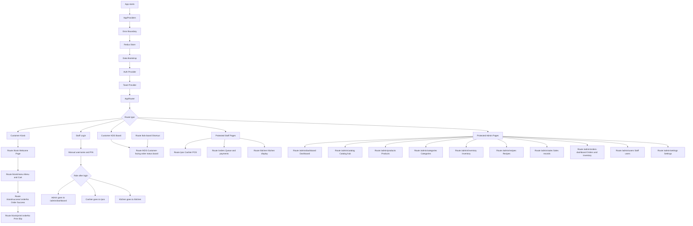
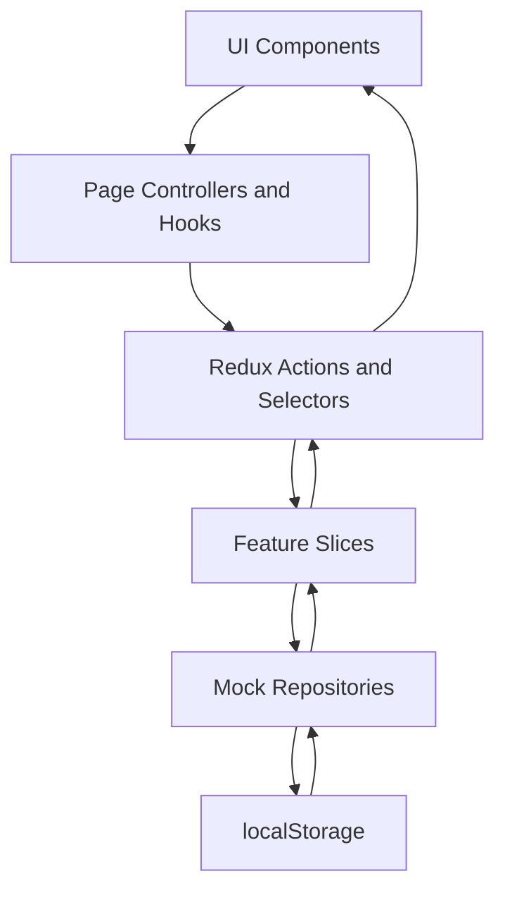

# Frontend Architecture

The frontend is a standalone React, TypeScript, Redux, and Vite application for a restaurant POS system.

It runs without a backend during local development. Data is stored in mock repositories and browser local storage.

## Main App Flow

The UI starts in `src/app/App.tsx`, loads the shared providers, then renders the app router.

## Order UI Flow

This is the main user journey from customer ordering to kitchen preparation.

```mermaid
flowchart LR
  A[Customer opens kiosk] --> B[Selects items]
  B --> C[Reviews cart]
  C --> D[Submits order]
  D --> E[Order is created as unpaid]
  E --> F[Cashier opens /orders or /pos]
  F --> G[Cashier takes payment]
  G --> H[Paid order enters kitchen queue]
  H --> I[Kitchen starts preparation]
  I --> J[Kitchen marks order ready]
  J --> K[Customer KDS shows ready status]
  K --> L[Cashier closes completed order]
```

## Route Groups

Public customer routes:

| Route | Screen |
| --- | --- |
| `/` | Redirects to `/kiosk` |
| `/kiosk` | Customer welcome screen |
| `/kiosk/menu` | Menu browsing and cart |
| `/kiosk/success/:orderNo` | Order confirmation |
| `/kiosk/print/:orderNo` | Printable order slip |
| `/KDS` | Customer-facing kitchen queue board |
| `/kds-board` | Shortcut redirect to `/KDS` |
| `/login` | Staff login |

Protected staff routes:

| Route | Allowed roles | Screen |
| --- | --- | --- |
| `/pos` | Admin, Cashier | Cashier POS |
| `/orders` | Admin, Cashier | Queue, payments, and cash drawer |
| `/kitchen` | Admin, Kitchen | Kitchen display system |

Protected admin routes:

| Route | Screen |
| --- | --- |
| `/admin/dashboard` | Admin overview |
| `/admin/catalog` | Catalog hub |
| `/admin/products` | Product management |
| `/admin/categories` | Category management |
| `/admin/orders-dashboard` | Orders and inventory dashboard |
| `/admin/sales-center` | Sales center |
| `/admin/sales` | Sales records |
| `/admin/inventory` | Inventory management |
| `/admin/recipes` | Recipes and ingredient usage |
| `/admin/replacements` | Replacement requests |
| `/admin/cash-adjustments` | Cash adjustment review |
| `/admin/audit-logs` | Audit logs |
| `/admin/users` | Staff user management |
| `/admin/settings` | Store and receipt settings |
| `/admin/administration` | Administration hub |

## Authentication Flow

Staff users sign in from `/login`.

The login result decides the first screen:

| Role | Default page |
| --- | --- |
| Admin | `/admin/dashboard` |
| Cashier | `/pos` |
| Kitchen | `/kitchen` |

Protected pages use `RequireAuth`.

If a user is not logged in, the app sends them to `/login`.

If a user is logged in but does not have permission for a page, the app sends them back to the correct default page for their role.

## Data Flow

## Folder Responsibilities

| Folder | Responsibility |
| --- | --- |
| `src/app` | App providers, router, layout, store setup |
| `src/features/auth` | Login, roles, auth state |
| `src/features/kiosk` | Customer ordering flow |
| `src/features/pos` | Cashier POS ordering flow |
| `src/features/orders` | Queue, payments, cash drawer, order actions |
| `src/features/kitchen` | Kitchen display and customer KDS board |
| `src/features/admin` | Admin dashboard, products, categories, users, settings |
| `src/features/inventory` | Inventory, recipes, deductions, import/export |
| `src/features/sales` | Sales records and reporting |
| `src/shared` | Shared components, styles, types, and helpers |

## Feature Pattern

Each feature should keep responsibilities separated:

| Layer | What belongs here |
| --- | --- |
| `pages` | Page composition and layout |
| `components` | Presentational UI pieces |
| `hooks` | Screen behavior and controller logic |
| `store` | Redux slices, selectors, and actions |
| `api` | Repository contracts and mock implementations |
| `types` | Feature contracts and DTOs |
| `mock` or `seed` | Initial local data |

## Important Files

| File | Purpose |
| --- | --- |
| `src/app/App.tsx` | Top-level app component |
| `src/app/providers/AppProviders.tsx` | Shared app providers |
| `src/app/router/AppRouter.tsx` | Main UI route map |
| `src/app/router/guards/RequireAuth.tsx` | Role and login protection |
| `src/features/auth/auth.utils.ts` | Default route for each role |
| `src/app/store/store.ts` | Redux store setup |
| `src/app/store/store.sync.ts` | Local persistence sync |

## Maintenance Notes

Keep route changes in sync with this document.

When adding a new screen, update `AppRouter.tsx`, the related navigation component, and this flow document.

When adding a new feature, follow the existing page, component, hook, store, api, and type separation so the code stays easy to trace.
